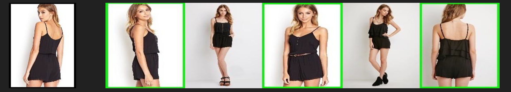
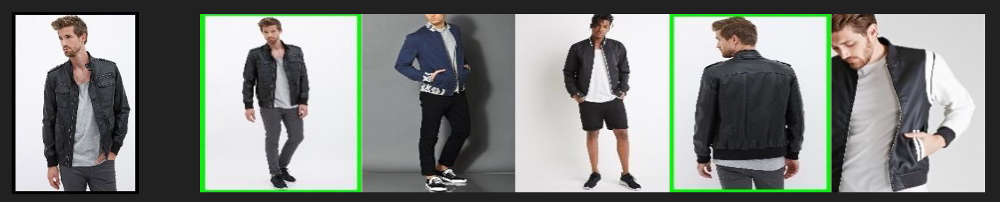
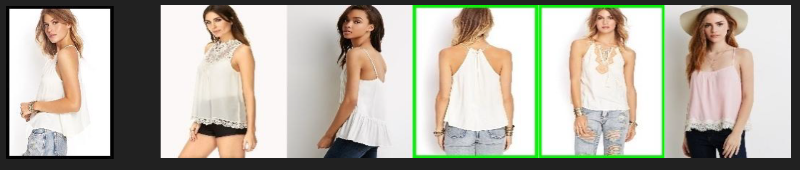
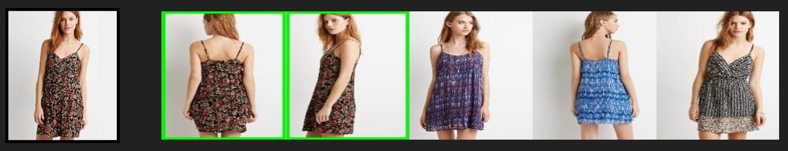
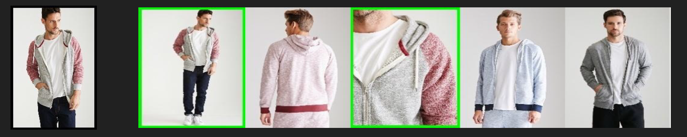
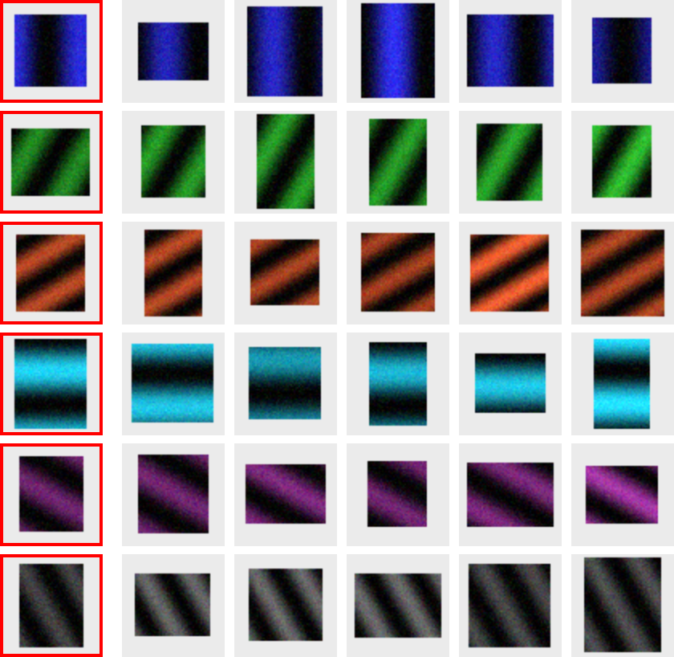

# AI-Powered Fashion Recommendation System

[](https://s-harshni.github.io/AI-Powered-Fashion-Recommendation-System/)


<!-- live-links -->
> 🔗 **Live project page:** [s-harshni.github.io/AI-Powered-Fashion-Recommendation-System/](https://s-harshni.github.io/AI-Powered-Fashion-Recommendation-System/)  
> 👤 **Portfolio:** [s-harshni.github.io/S-Harshni/](https://s-harshni.github.io/S-Harshni/)  
<!-- live-links -->

Visual "more like this" recommendations for clothing. A ResNet trained on DeepFashion learns to classify garments and localise them (bounding-box regression). Its 64-dimensional feature layer then serves as an embedding for **nearest-neighbour search**, so the most visually similar items (fabric, cut, pattern) are recommended.



## Pipeline

```
DeepFashion images ─► preprocessing.py ─► ResNet (simple_resnet.py) ─► feature layer (64-d)
  + bounding boxes       crop / resize        classification + bbox          │
                         to 64×64             multi-task loss                ▼
                                                               recommend.py: cosine k-NN ─► top-k similar items
```

| Stage | File | What it does |
|---|---|---|
| Preprocessing | `code/preprocessing.py` | Reads DeepFashion annotations, rescales bounding boxes, builds train/validation CSVs |
| Input pipeline | `code/fashion_input.py` | Loads and resizes images to 64×64, whitening, random batches |
| Model | `code/simple_resnet.py` | ResNet (6n+2 layers) with batch norm, dropout, a classification head (`NUM_LABELS = 6`) and a bounding-box regression head |
| Training / testing | `code/train_n_test.py` | Momentum SGD with step decay, EMA-smoothed error tracking, checkpoints; `test()` exports the feature layer |
| Recommendation | `code/recommend.py` | L2-normalised features, cosine `NearestNeighbors`, query → top-k grid image |
| Verification | `code/smoke_test.py` | Trains the real model on synthetic data and checks retrieval end to end (no dataset needed) |

## Sample results (DeepFashion)

Each row shows a query garment followed by its nearest neighbours in feature space.

| Jackets | Blouses & shirts |
|---|---|
|  |  |

| Dresses | Hoodies |
|---|---|
|  |  |

## Quick check: run it without the dataset

```bash
pip install -r requirements.txt
cd code
python smoke_test.py            # ~40 s on a laptop CPU
```

The smoke test builds the actual ResNet and loss and trains for 300 steps on synthetic 64×64 garments (6 classes with different colours and stripe patterns). It then extracts the feature layer for a held-out set and measures retrieval quality:

```
step    0  loss 2.388  train top-1 error 0.84
step  299  loss 0.081  train top-1 error 0.00
feature matrix (192, 64), precision@5 of nearest-neighbour retrieval: 1.00 (chance 0.17)
SMOKE TEST PASSED
```



## Train on DeepFashion

1. Download the [DeepFashion Attribute Prediction](http://mmlab.ie.cuhk.edu.hk/projects/DeepFashion/AttributePrediction.html) subset (289,222 images, 50 categories, 1,000 attributes, with bounding boxes) into `data/`.
2. Build the CSVs: `python code/preprocessing.py`
3. Train: `python code/train_n_test.py --version exp1` (flags in `code/hyper_parameters.py`: learning rate, weight decay, residual blocks, data paths)
4. Export features with `Train().test()` (saved to `--fc_path`), then get recommendations:

```bash
python code/recommend.py --features data/catalog_fc.npy --images data/catalog.csv --query 0 --k 5
```

## What this version changes

- **Runs on TensorFlow 2**: ported from TF 1.x (`tf.compat.v1`) and replaced the removed `tf.contrib` initializers and regularizers; pandas `.as_matrix()` → `.to_numpy()`.
- **Fixed** `test()`, which unpacked two values from `inference()` although it returns three.
- **Added** `recommend.py` (the k-NN recommendation step) and `smoke_test.py`.
- Training no longer starts on import (`if __name__ == '__main__'`), so the modules can be reused.

## Credits

Model and training code are based on [khanhnamle1994/fashion-recommendation](https://github.com/khanhnamle1994/fashion-recommendation) (sample results images from that project). Dataset: Liu et al., *DeepFashion*, CVPR 2016.

## Author

**S Harshni** · [Portfolio](https://s-harshni.github.io/S-Harshni/) · [LinkedIn](https://www.linkedin.com/in/ks-harshni/) · [GitHub](https://github.com/S-Harshni)
